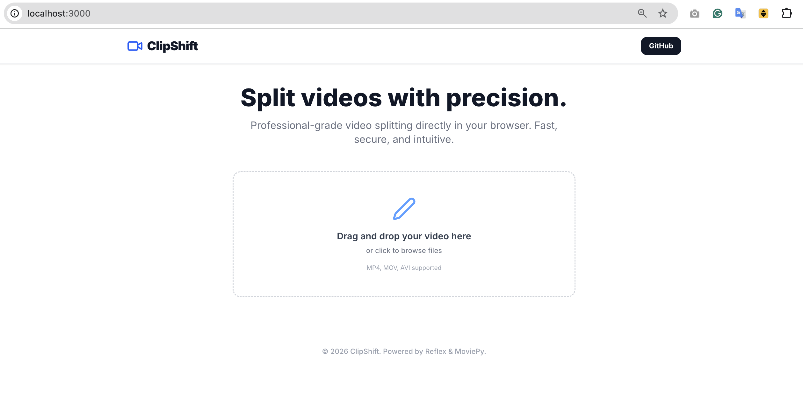
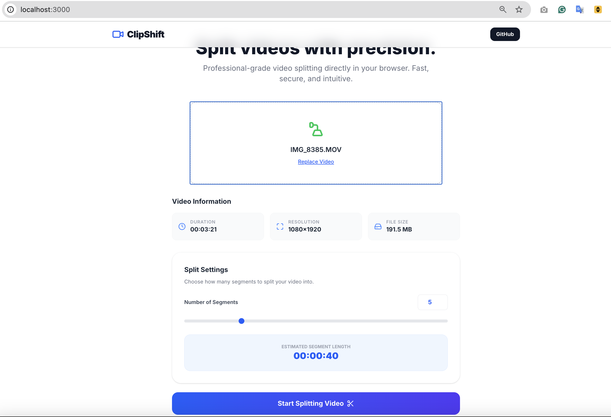
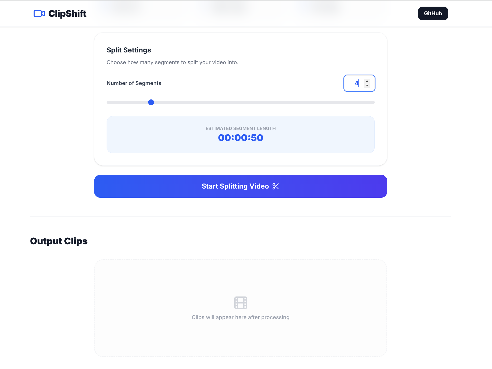
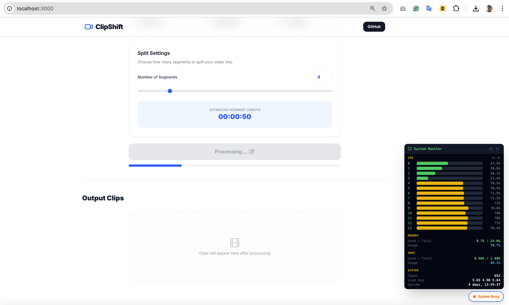
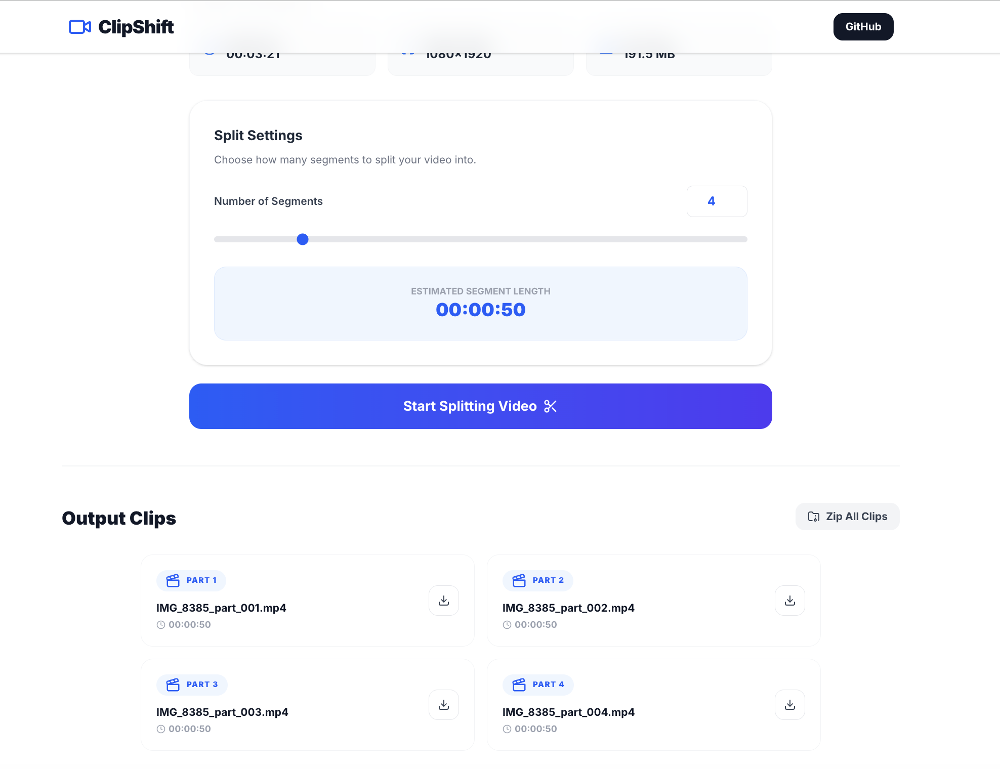

# Video Segment Splitter

> Important: Before working on this project, read [AGENTS.md](AGENTS.md) for required workflows and tooling expectations.

## Software Design Document

The software design document (SDD) for this project is available at [Video Segment Splitter (ClipShift) - Software Design Document (SDD).pdf](docs/Video%20Segment%20Splitter%20(ClipShift)%20-%20Software%20Design%20Document%20(SDD).pdf).

## Quick Start (With Screenshots)

Follow these steps to split your video quickly, even on your first use:

### 1) Open the landing page

After opening the app, you will see the upload area in the center.



### 2) Upload your video

Drag and drop your video into the upload area (or click to browse). Supported formats: MP4, MOV, AVI.



### 3) Set the number of segments

Use **Number of Segments** (number input or slider) to choose how many parts to create. The UI also shows the estimated duration per segment.



### 4) Start splitting

Click **Start Splitting Video** to begin processing. A progress state will be shown while splitting.


### 5) (Optional) Monitor system load

When splitting longer videos, you can open the system monitor to observe CPU and memory usage.



### 6) Download results

After processing completes, the generated clips will appear in **Output Clips**. You can:

- Download clips one by one
- Click **Zip All Clips** to generate and download a ZIP bundle




## Getting Started

> Before making changes, read the project guidelines in [AGENTS.md](AGENTS.md).

This project is managed with [Poetry](https://python-poetry.org/).

### Prerequisites

Based on this project's dependencies, install the following system-level packages first via Homebrew (macOS):

```bash
brew install python@3.11 ffmpeg poetry
```

| Package | Reason |
|---------|--------|
| `python@3.11` | The project requires Python ~3.11 as specified in `pyproject.toml` |
| `ffmpeg` | Required by `moviepy` for video cutting, merging, and transcoding |
| `poetry` | Python dependency manager used to manage this project |

After installing Playwright (via `poetry install`), you also need to download browser binaries:

```bash
poetry run playwright install
```

### Installation

1. Ensure Poetry uses Python 3.11:

```bash
poetry env use python3.11
poetry env info
```

2. Install dependencies:

```bash
poetry install
```

### Running the App

Start the development server:

```bash
poetry run ./reflex_rerun.sh
```

The application will be available at `http://localhost:3000`.

### Clean Rebuild & Run

To fully clean the environment, reinstall all dependencies, and start the app in one step:

```bash
./proj_reinstall.sh --with-rerun
```

This will remove existing Poetry virtual environments and Reflex artifacts, recreate the environment from scratch, and automatically launch the app afterwards.

